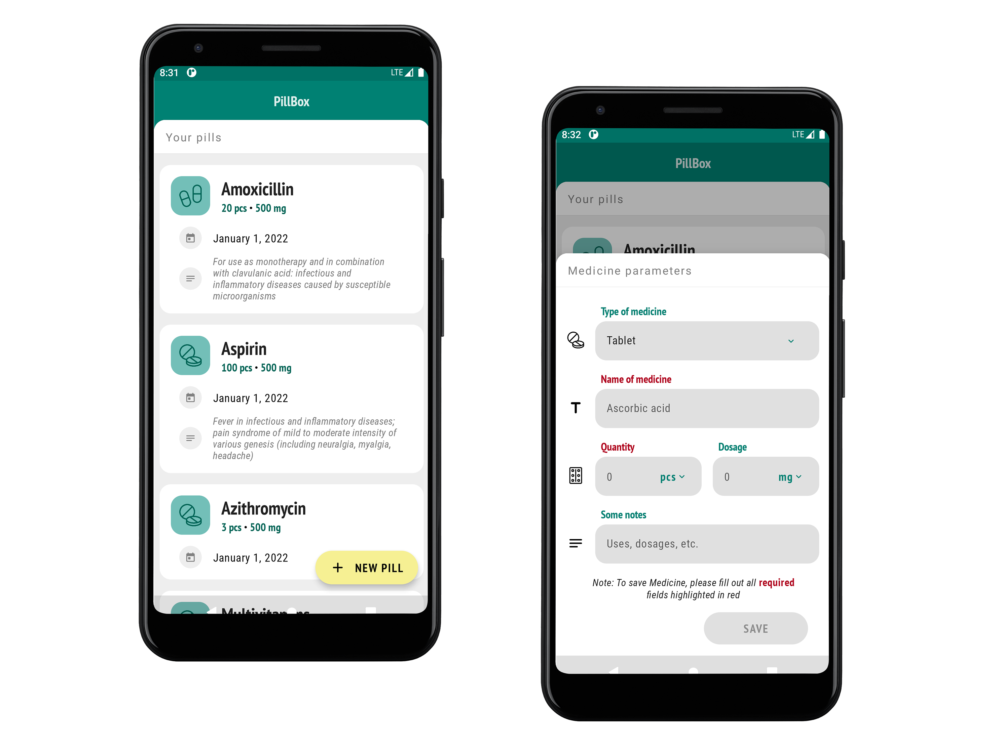

# PillBox Demo
An electronic version of a medicine kit that allows you to store basic information about the medicines you have at home. The app is written as part of the Jetpack Compose basics study.

### Components & Versions
- Jetpack Compose 1.0.4
- Accompanist 0.18.0
- Room 2.3.0
- Coroutines 1.5.0
- Kotlin 1.5.31
